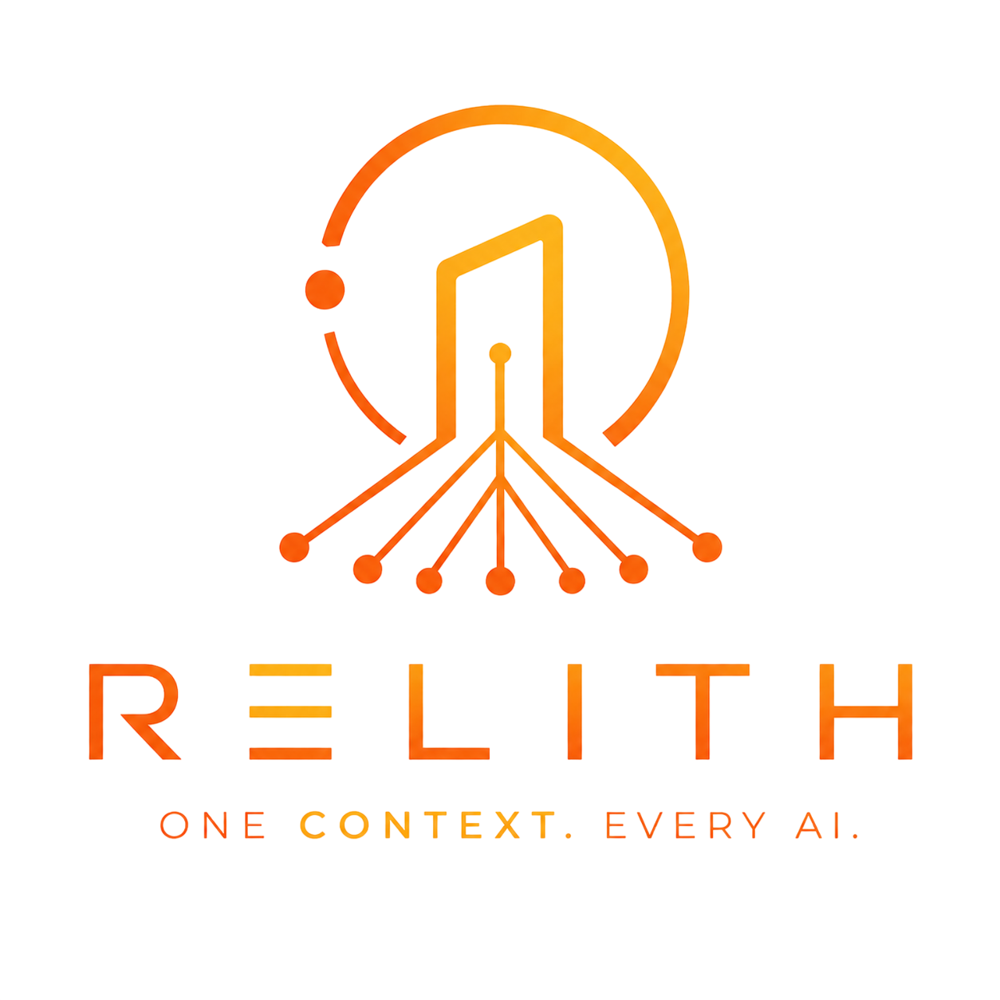

<p align="center">
  <picture>
    <source media="(prefers-color-scheme: dark)" srcset="images/logo.png">
    
  </picture>
</p>

<p align="center">
  <a href="https://github.com/cryskram/relith/releases"></a>
  <a href="https://github.com/cryskram/relith/stargazers"></a>
  <a href="https://go.dev"></a>
  <a href="LICENSE"></a>
  <a href="#"></a>
</p>

<br>

Relith is a **local-first context engine** for AI-assisted coding. It indexes your codebases and exposes them through a unified MCP interface — one index, any AI.

Instead of every AI tool building its own isolated context, Relith is a **shared intelligence layer**: Cursor, Claude Code, OpenCode, and any MCP client query it for code search, symbol lookup, reference tracking, dependency graphs — and now, **git history**.

## Features

- **MCP-native** — 21 tools for AI assistants: search, symbols, references, definitions, callers/callees, file outline, dependency tracing, graph queries, architecture overview, commits, blame, and diffs
- **Git-aware context** — ask *when / why / who*: recent commits, per-file history (follows renames), per-line blame, and full patches between any two refs
- **Cross-file reasoning** — one `trace_context` bundle combining FTS search + symbol matches + references + graph neighbors
- **Knowledge graph** — typed dependency graph (import edges for Go/JS/TS/Python/Rust, reference co-occurrence for all), visualized with an interactive D3.js force-directed graph
- **Symbol & reference extraction** — functions, types, methods, interfaces, enums, macros across 17 languages
- **Multi-repo** — index unlimited repos, search across all at once
- **Self-healing watcher** — auto-reindexes changed files via fsnotify
- **Terminal UI** — Bubble Tea progress bars, spinners, and a server dashboard
- **REST API** — HTTP server for scripts, CI pipelines, and programmatic access
- **One binary, local-first** — Go, no npm/pip/uv, no Docker, no runtime, your code never leaves your machine

### Performance

Linux kernel, 94,989 files, 1.7M chunks:

| Phase | Time |
|-------|------|
| Walk + index | 14m 40s |
| Graph build | 1m 8s |
| **Total** | **15m 48s** |

## Quick Start

```bash
git clone https://github.com/cryskram/relith.git && cd relith
make build-all

./bin/relith repo add /path/to/your/project
./bin/relith index
./bin/relith search "your query"

# Wire your AI agent (OpenCode, Cursor, Claude Code)
./bin/relith install

# Daemon: REST API + graph UI + file watcher
./bin/relith serve
```

> **macOS**: If Gatekeeper blocks the downloaded binary, run `xattr -d com.apple.quarantine /path/to/binary`.

## CLI

Interactive commands (`index`, `remove`, `serve`) render a Bubble Tea TUI automatically; otherwise they print plain text.

| Command | Description |
|---------|-------------|
| `relith repo add <path>` | Register a repository for indexing |
| `relith repo list` | List all indexed repositories |
| `relith repo remove <id-or-name>` | Remove a repository and all its data |
| `relith index [path]` | Index a repo (or all pending) |
| `relith search <query>` | Full-text search across all indexed code |
| `relith status` | Show indexing status with file/chunk counts |
| `relith serve` | Start the daemon (REST API + graph UI + file watcher) |
| `relith install` | Auto-configure MCP for OpenCode, Cursor, Claude Code |
| `relith uninstall` | Remove relith MCP configuration from agents |
| `relith db vacuum` | Reclaim unused database space |
| `relith version` | Print the version |
| `relith search <query> --limit=N` | Limit search results |

## MCP Server

Relith speaks the [Model Context Protocol](https://modelcontextprotocol.io) over stdio. Point any MCP-compatible assistant at `relithmcp`, and the tools show up automatically — no glue code.

```bash
relith install                 # auto-detect installed agents
relith install --agent=cursor  # or target a specific one
relith install --agent=code    # Claude Code
```

### Git-aware tools

On any repo that's a git worktree, the AI can also ask:

| Tool | Answer |
|------|--------|
| `get_recent_commits` | What's been done recently (hash, author, date, message) |
| `get_file_history` | What has this file been through |
| `get_blame` | Who owns each line of this file |
| `get_diff` | Exactly what a commit / PR changed (stat + patch) |

These shell out to your system `git`, so they always match the repo's real state.

### Full tool list

| Category | Tools |
|----------|-------|
| **Search** | `search_code`, `find_symbol`, `find_references`, `find_callers`, `find_callees` |
| **Files** | `get_file_content`, `get_file_outline`, `get_file_tree`, `get_repo_summary` |
| **Graph** | `get_related_files`, `list_hub_files`, `query_graph`, `get_architecture`, `trace_dependency` |
| **Git** | `get_recent_commits`, `get_file_history`, `get_blame`, `get_diff` |
| **Reasoning** | `trace_context`, `get_symbol_definition`, `list_repositories` |

### Manual setup

| Agent | Where |
|-------|-------|
| **Cursor** | Settings → MCP Servers → Add: command `/path/to/relithmcp` |
| **Claude Code** | `~/.config/claude/mcp.json` → `{"mcpServers": {"relith": {"command": "/path/to/relithmcp"}}}` |

## REST API

Via the daemon:

```bash
curl -s 127.0.0.1:9876/v1/health
curl -s "127.0.0.1:9876/v1/search?q=sqlite"
curl -s 127.0.0.1:9876/v1/graph          # interactive graph (browser)
curl -s 127.0.0.1:9876/v1/graph?repo=my-repo  # graph data (JSON)
```

## Configuration

`~/.config/relith/relith.yaml` (or `%LOCALAPPDATA%\Relith\relith.yaml`). Any key overrides with a `RELITH_` env var (`RELITH_INDEXER_CONCURRENCY=8`).

```yaml
core:
  data_dir: ~/.local/share/relith
daemon: { tcp_host: 127.0.0.1, tcp_port: 9876 }
mcp:    { enabled: true, transport: stdio }
indexer: { concurrency: 4, max_file_size: 10485760 }
watcher: { enabled: true, debounce: 1s }
search: { max_results: 100, path_boosting: true }
```

## How it works

Three binaries share one SQLite (FTS5 + WAL) database:

| Binary | Role |
|--------|------|
| `relith` | CLI + TUI |
| `relithd` | REST API + graph UI + file watcher |
| `relithmcp` | MCP server over stdio |

`Walk → chunk → extract symbols & refs → build dependency graph → serve` via MCP, HTTP, or TUI.

See [ARCHITECTURE.md](ARCHITECTURE.md) for the full picture.

## License

MIT — see [LICENSE](LICENSE).